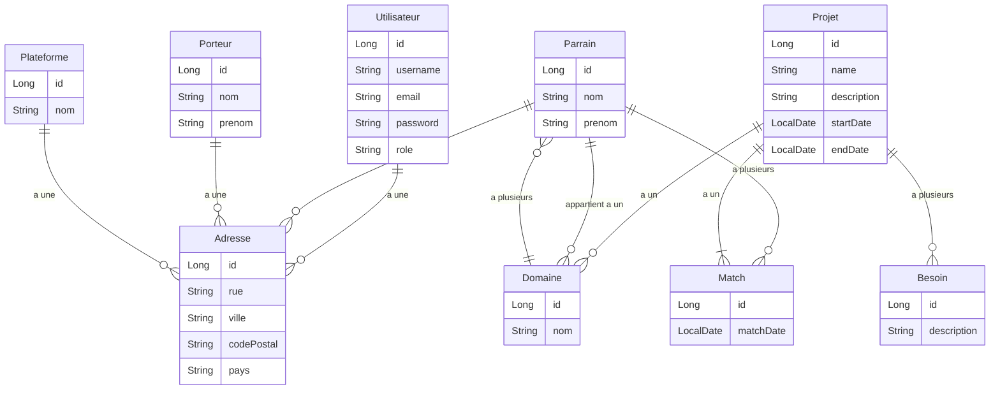
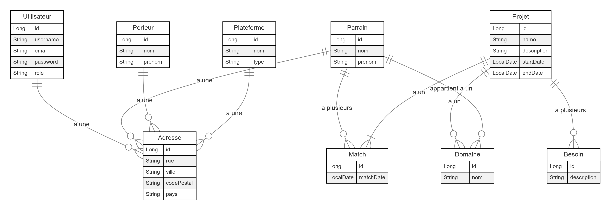

# Application Trouve Ton Match -- Cahier des charges

[Description des besoins	1](#_toc796073773)

[Spécifications fonctionnelles	1](#_toc1500008663)

[Minimum Viable Product	1](#_toc764574455)

[Evolutions futures	1](#_toc1796423408)

[Les livrables	2](#_toc903773406)

[Spécifications techniques	2](#_toc143369225)

[Technologies	2](#_toc271491847)

[Navigateurs	2](#_toc1174936509)

[Arborescence	2](#_toc533798455)

[Pages (MVP)	2](#_toc560641322)

[Parcours utilisateur	2](#_toc2081312639)

[User Stories	4](#_toc608720994)

[Parcours Administrateur	4](#_toc1601440941)

[Parcours Porteur de projet	5](#_toc575833888)

[Parcours Parrain	6](#_toc961176954)

[Parcours de Match	6](#_toc728353812)

[Evolutions futures	7](#_toc319793991)

[Routes	7](#_toc1947223139)

[Charte graphique	8](#_toc1788108)

[Base de données	9](#_toc193866751)

[Informations nécessaires :	9](#_toc1914916349)

[MCD	10](#_toc1309236536)

[Code Mermaid.js	10](#_toc818390567)

[Diagramme	12](#_toc1906522261)

[Gestion de projet	13](#_toc793816953)

[EPIC 1 : Gestion des utilisateurs	13](#_toc452203009)

[EPIC 2 : Gestion des profils utilisateurs	13](#_toc719131962)

[EPIC 3 : Gestion des projets des porteurs	14](#_toc1362058803)

[EPIC 4 : Gestion des parrains	14](#_toc1189342838)

[EPIC 5 : Gestion des matchs	14](#_toc1172013458)

[EPIC 6 : Tableau de bord administrateur	14](#_toc692254749)

[EPIC 7 : Évolutions futures	14](#_toc1976447153)

# Description des besoins
Initiative Deux-Sèvres est une association ayant pour objectif la mise en relation de porteurs de projets et de parrains, permettant la réalisation des projets portés.

Dans ce cadre, l’association souhaite une application permettant de mettre en relation les acteurs, afin de la fluidifier et de faciliter les échanges.

# Spécifications fonctionnelles
## Minimum Viable Product
Les utilisateurs ne peuvent pas créer leur compte. Celui-ci sera créé par un administrateur. La création par l’administrateur déclenche l’envoi d’un lien d’activation à l’utilisateur, qui peut compléter son profil en cliquant sur ce lien.

Les utilisateurs sont de deux types : 

- Porteur,
- Parrain (ou Marraine)

Les Parrains peuvent consulter les projets des porteurs, et sélectionner ceux qu’ils veulent supporter. 

Les Porteurs peuvent consulter la présentation des Parrains et sélectionner CELUI qui correspond à leur besoin d’accompagnement.

Lorsque qu’un match est fait (Un Porteur a choisi un Parrain, ce même Parrain a choisi le projet de ce Porteur), une alerte est envoyée à l’administrateur (ou permanent) de l’association, et les coordonnées du Porteur sont transmises au Porteur. Une icône spécifique s’affiche alors sur le projet concerné.

## Evolutions futures
- Filtrage des parrains par zone géographique
- Filtrage des parrains par réseau 
- Filtrage des parrains par disponibilités
- Rôle Super-Admin qui peut créer des plateformes (le MVP concerne uniquement Initiative Deux-Sèvres, le Super-Admin pourra créer Gironde par exemple)
- Zone d’échange/messagerie sur le site
- Filtrage des projets par besoin
- Espace “Mes Matchs”
- Espace “Boite à outils”
- Espace “Messagerie”

# Les livrables
- Site léger pour les utilisateurs
- Dashboard pour les administrateurs
- Base de données
- Evolution future : application smartphone

# Spécifications techniques

## Technologies
- Front : React dernière version
- Back : Spring Boot 3.3.1
- BDD : PostgreSQL
## Navigateurs
- Firefox >124
- Chrome, Edge > 123
- Safari >17.4
- Opera > 109

# Arborescence
## Pages (MVP)
- Login
- Profil utilisateur
- Les projets
- Les parrains
# Parcours utilisateur
1\. Parcours Administrateur

**Objectif** : Gérer les utilisateurs (Porteurs et Parrains) et superviser les matchs.

**Création de compte** :
L'administrateur crée le compte d'un utilisateur (Porteur ou Parrain) depuis un tableau de bord.
Action déclenche : l'envoi d'un lien d'activation par mail à l'utilisateur.

**Gestion des comptes** :
L'administrateur peut consulter, modifier ou désactiver les comptes utilisateurs via un dashboard.

**Suivi des matchs** :
Lorsqu'un "match" est fait entre un porteur et un parrain, une alerte est envoyée à l'administrateur.
L'administrateur peut valider, suivre, ou contacter les parties prenantes du match.

2\. Parcours Porteur de Projet

**Objectif** : Trouver un Parrain correspondant à son besoin.

**Activation de compte** :
Le porteur reçoit un lien d'activation par mail pour compléter son profil.

**Compléter le profil** :
Une fois connecté, le porteur remplit des informations comme le nom, l'activité, les besoins d'accompagnement, la zone géographique, etc.

**Consultation des parrains** :
Le porteur peut consulter une liste de parrains disponibles avec des filtres (zone géographique, domaine d'expertise, etc.).

**Sélection de parrain** :
Après avoir consulté les profils, le porteur sélectionne un parrain qui correspond à ses besoins d'accompagnement.

3\. Parcours Parrain (ou Marraine)

**Objectif** : Trouver un projet à supporter.

**Activation de compte** :
Le parrain reçoit également un lien d'activation pour compléter son profil.

**Compléter le profil** :
Le parrain renseigne son nom, son parcours, son réseau professionnel, ses domaines d'expertise, et ses disponibilités.

**Consultation des projets** :
Le parrain a accès à la liste des projets des porteurs. Il peut filtrer les projets par besoin ou domaine d'activité.

**Sélection de projet** :
Après avoir examiné plusieurs projets, le parrain peut choisir un ou plusieurs projets qu'il souhaite accompagner.

4\. Parcours de Match

**Objectif** : Finaliser un partenariat entre un porteur et un parrain.

**Condition de match** :
Un match se fait lorsque le porteur et le parrain se choisissent mutuellement.

**Notification et suivi** :
Une notification est envoyée à l'administrateur, et les coordonnées du porteur sont partagées au parrain.

**Icône Match** :
Un indicateur visuel (icône) s'affiche sur le projet concerné, indiquant qu'un match a été fait.

5\. Évolutions Futures (Parcours en Messagerie)

**Objectif** : Améliorer la communication entre les utilisateurs.

**Messagerie interne** :
Après un match, le porteur et le parrain peuvent échanger via une messagerie intégrée à l'application.

**Espace “Mes Matchs”** :
Un espace dédié permet à l'utilisateur (parrain ou porteur) de suivre ses projets/matchs en cours.

**Filtrage des utilisateurs** :
L'implémentation de filtres supplémentaires (géographique, réseau, disponibilités) permettra une meilleure personnalisation de la recherche de parrains ou de projets.

# User Stories
## Parcours Administrateur
- **US01** : En tant qu’administrateur, je veux pouvoir créer les comptes des porteurs et des parrains afin qu'ils puissent accéder à l’application.
  - Critères d’acceptation :
    - Depuis un tableau de bord, je peux créer un compte pour un utilisateur.
    - Un lien d’activation est automatiquement envoyé par e-mail après la création du compte.
- **US02** : En tant qu’administrateur, je veux pouvoir modifier, consulter ou désactiver les comptes des utilisateurs depuis un tableau de bord, pour gérer les accès.
  - Critères d’acceptation :
    - Je peux afficher les informations détaillées d’un compte.
    - Je peux désactiver ou modifier un compte utilisateur.
- **US03** : En tant qu’administrateur, je veux être alerté lorsqu’un match est réalisé entre un porteur et un parrain, afin de superviser les mises en relation.
  - Critères d’acceptation :
    - Lorsqu’un porteur et un parrain se sélectionnent mutuellement, une notification me parvient.
    - Je peux voir les détails du match et contacter les deux parties.

## Parcours Porteur de projet
- **US04** : En tant que porteur de projet, je veux pouvoir activer mon compte en suivant le lien envoyé par e-mail afin de commencer à utiliser l'application.
  - Critères d’acceptation :
    - Un lien d’activation est envoyé après la création de mon compte.
    - Après avoir cliqué sur ce lien, je suis redirigé vers une page pour compléter mon profil.
- **US05** : En tant que porteur de projet, je veux compléter mon profil avec des informations comme mes besoins d’accompagnement, afin d’aider les parrains à mieux comprendre mon projet.
  - Critères d’acceptation :
    - Je peux renseigner des champs tels que le nom de mon entreprise, ma zone géographique, mes besoins, etc.
- **US06** : En tant que porteur de projet, je veux consulter une liste de parrains et filtrer les résultats en fonction de certains critères (zone géographique, domaine d'expertise), afin de trouver un parrain adapté à mon projet.
  - Critères d’acceptation :
    - Une liste de parrains est affichée avec des options de filtrage.
- **US07** : En tant que porteur de projet, je veux pouvoir sélectionner un parrain correspondant à mon besoin, afin de formaliser ma demande de mise en relation.
  - Critères d’acceptation :
    - Je peux sélectionner un parrain après avoir consulté son profil.

## Parcours Parrain

- **US08** : En tant que parrain, je veux activer mon compte via un lien reçu par e-mail pour accéder à l'application et compléter mon profil.
  - Critères d’acceptation :
    - Après avoir cliqué sur le lien d’activation, je suis redirigé vers la page pour compléter mon profil.
- **US09** : En tant que parrain, je veux pouvoir remplir mon profil avec des informations comme mon parcours et mes disponibilités pour que les porteurs de projet puissent bien me connaître.
  - Critères d’acceptation :
    - Je peux renseigner des informations sur mon entreprise, mon réseau, et mes domaines d’expertise.
- **US10** : En tant que parrain, je veux consulter une liste de projets portés par des porteurs de projet et filtrer les résultats selon mes critères (besoin d’accompagnement, domaine), pour trouver des projets qui m'intéressent.
  - Critères d’acceptation :
    - Une liste de projets est disponible avec des options de filtrage (besoin d’accompagnement, etc.).
- **US11** : En tant que parrain, je veux pouvoir sélectionner un ou plusieurs projets qui m’intéressent, afin de manifester mon souhait de les accompagner.
  - Critères d’acceptation :
    - Je peux choisir un projet parmi la liste proposée.

## Parcours de Match

- **US12** : En tant que porteur, je veux être notifié lorsque le parrain que j’ai sélectionné a aussi choisi mon projet, pour formaliser notre mise en relation.
  - Critères d’acceptation :
    - Une notification apparaît sur mon profil lorsque le parrain a sélectionné mon projet.
- **US13** : En tant que parrain, je veux recevoir les coordonnées du porteur lorsque le match est confirmé, pour que je puisse le contacter directement.
  - Critères d’acceptation :
    - Après confirmation du match, les coordonnées du porteur sont envoyées au parrain.
- **US14** : En tant qu’utilisateur (porteur ou parrain), je veux voir un indicateur visuel lorsqu’un match est effectué, pour identifier facilement les projets en cours de partenariat.
  - Critères d’acceptation :
    - Une icône spécifique s’affiche sur le projet une fois le match réalisé.

## Evolutions futures
- **US15** : En tant qu’utilisateur, je veux pouvoir échanger avec mes matchs via une messagerie interne à l’application, pour faciliter la communication.
  - Critères d’acceptation :
    - Une zone de messagerie est disponible après qu’un match est réalisé.
- **US16** : En tant qu’utilisateur, je veux un espace “Mes Matchs” pour suivre les projets ou les parrains avec lesquels j’ai un match, afin de gérer mes collaborations en cours.
  - Critères d’acceptation :
    - Un espace dédié liste mes matchs actuels.
- **US17** : En tant qu’utilisateur, je veux pouvoir filtrer les porteurs et parrains par zone géographique, réseau, et disponibilité, afin d’affiner ma recherche.
  - Critères d’acceptation :
    - Des filtres supplémentaires sont disponibles pour personnaliser les recherches.

# Routes

|**Entité**|**Route**|**Méthode HTTP**|**Description**|
| :- | :- | :- | :- |
|**Utilisateur**|/api/users/create|POST|Créer un utilisateur (parrain ou porteur)|
||/api/users/{id}|GET|Récupérer les détails d’un utilisateur|
||/api/users/{id}|PUT|Modifier un utilisateur|
||/api/users/{id}|DELETE|Supprimer un utilisateur|
||/api/users/activate/{activationCode}|POST|Activer un compte utilisateur avec un code d'activation|
||/api/login|POST|Authentification d’un utilisateur|
||/api/me|GET|Récupérer les informations de l'utilisateur connecté|
|**Parrain**|/api/parrains|GET|Récupérer la liste des parrains disponibles|
||/api/parrains/{id}|PUT|Mettre à jour les informations d'un parrain|
||/api/parrains/matches|GET|Récupérer les matchs associés au parrain connecté|
||/api/parrains/match/{projectId}|POST|Sélectionner un projet pour un match|
|**Porteur**|/api/porteurs|GET|Récupérer la liste des porteurs disponibles|
||/api/porteurs/{id}|PUT|Mettre à jour les informations d’un porteur|
||/api/porteurs/{id}/projects|POST|Créer un projet pour un porteur spécifique|
||/api/porteurs/matches|GET|Récupérer les matchs associés au porteur connecté|
|**Projet**|/api/projects|GET|Récupérer la liste de tous les projets disponibles|
||/api/projects/{id}|GET|Récupérer les détails d’un projet spécifique|
||/api/projects|POST|Créer un nouveau projet|
||/api/projects/{id}|PUT|Modifier un projet existant|
||/api/projects/{id}|DELETE|Supprimer un projet|
||/api/projects/matches|GET|Récupérer la liste des projets ayant un match|
|**Match**|/api/matches|GET|Récupérer la liste des matchs entre parrains et porteurs|
||/api/matches|POST|Créer un match entre un parrain et un projet|
||/api/matches/{id}|DELETE|Supprimer un match existant|
||/api/matches/parrain|GET|Récupérer les matchs liés au parrain connecté|
||/api/matches/porteur|GET|Récupérer les matchs liés au porteur connecté|
|**Rôle**|/api/roles/assign|POST|Assigner un rôle (Admin, Parrain, Porteur) à un utilisateur|
||/api/roles|GET|Récupérer la liste des rôles disponibles|
||/api/roles/{roleId}/assign/{userId}|POST|Assigner un rôle spécifique à un utilisateur|
|**Notification**|/api/notifications/email|POST|Envoyer un email d'activation ou de notification à un utilisateur|
||/api/notifications|GET|Récupérer les notifications pour l'utilisateur connecté|
||/api/notifications/mark-as-read/{id}|POST|Marquer une notification comme lue|
|**Statistique**|/api/statistics|GET|Récupérer les statistiques globales|
||/api/statistics/matches|GET|Récupérer des statistiques spécifiques aux matchs|
||/api/statistics/users/{id}|GET|Récupérer les statistiques spécifiques à un utilisateur|
|**Adresse**|/api/addresses|POST|Ajouter une nouvelle adresse|
||/api/addresses/{id}|PUT|Modifier une adresse existante|
||/api/addresses|GET|Récupérer la liste des adresses|
||/api/addresses/{id}|DELETE|Supprimer une adresse|

# Charte graphique

**Couleurs principales** :

- Vert : #71c920
- Rose : #e31766
- Fond : #e7ffcc ou blanc au choix

**Polices** :

- Principale : Fira Sans
- Secondaires (chat, ...) : au choix

**Site** :

- Responsive :
  - Nav Bar étendue mode Desktop (tous liens visibles)
  - Menu Burger mode smartphone (à gauche)
- Logo : haut centre
- Icône profil : haut droite
- Footer : (écriture roses, fond rose pâle)
  - Logo mini
  - mail de contact plateforme (<accompagnement@initiativedeuxsevres.fr>)
  - 0679875609
  - Logos LinkedIn, Instagram, TikTok, Facebook
# Base de données
## Informations nécessaires :
Profil Porteur :

- Nom
- Prénom
- Entreprise
- Plateforme Initiative (Deux-Sèvres par défaut)
- Date initiale (du lancement ou de la reprise d’activité)
- Domaine d’activité (Enum?)
- Description de l’activité
- Besoins identifiés
- Lieu de l’activité
- Disponibilités

Profil Parrain :

- Nom
- Prénom
- Entreprise
- Plateforme Initiative (Deux-Sèvres par défaut)
- Présentation du parcours
- Réseau (Enum ?)
- Domaine(s) d’expertise
- Lieux de déplacement possibles
- Disponibilités

Liste des domaines d'activité :

- Activités de services administratifs et de soutien 
- Activités spécialisées, scientifiques et techniques 
- Agriculture, sylviculture, pêche 
- Arts, spectacles et activités récréatives 
- Commerce et réparation 
- Construction-BTP 
- Enseignement 
- Hôtels, cafés et restaurants 
- Industrie 
- Information et communication 
- Production et distribution d’eau, assainissement, gestion des déchets et dépollution 
- Production et distribution d’électricité, de gaz, de vapeur d’air conditionné 
- Santé humaine et action sociale 
- Services aux entreprises 
- Services aux particuliers 
- Transports

Liste des besoins (types d’accompagnement)

- Ressources humaines 
- Finance / Comptabilité
- Juridique
- Informatique 
- Commercial / Communication

## MCD
Le choix est fait de séparer les informations dans des tables dédiées pour faciliter les évolutions futures (par exemple, les adresses seront dans une table ADRESSE pour faciliter le filtrage géographique, de même pour PLATEFORME)

### Code Mermaid.js

### Diagramme

# Gestion de projet

Compte tenu du mode individuel de réalisation de ce projet, je choisis d’utiliser la méthode Kanban.

<https://github.com/users/JCMaif/projects/4/views/1>

Les EPICS identifiés, hors des tâches de création et d’initialisation de l’application et de création de la base de données :
### **EPIC 1 : Gestion des utilisateurs**
- US 1.1 : Création de compte par l'administrateur
- US 1.2 : Activation de compte par l'utilisateur
- US 1.3 : Gestion des utilisateurs (modification/désactivation)
### **EPIC 2 : Gestion des profils utilisateurs**
- US 2.1 : Compléter le profil porteur
- US 2.2 : Compléter le profil parrain
### **EPIC 3 : Gestion des projets des porteurs**
- US 3.1 : Création d'un projet par le porteur
- US 3.2 : Consultation des projets par les parrains
- US 3.3 : Sélection d'un projet par le parrain
### **EPIC 4 : Gestion des parrains**
- US 4.1 : Consultation des parrains par les porteurs
- US 4.2 : Sélection d'un parrain par le porteur
### **EPIC 5 : Gestion des matchs**
- US 5.1 : Création d'un match
- US 5.2 : Notification à l'administrateur lors d'un match
- US 5.3 : Transmission des coordonnées du porteur
- US 5.4 : Icône spécifique pour les matchs
### **EPIC 6 : Tableau de bord administrateur**
- US 6.1 : Visualisation des utilisateurs et des matchs
- US 6.2 : Gestion des alertes et notifications
### **EPIC 7 : Évolutions futures**
- US 7.1 : Filtrage avancé des utilisateurs
- US 7.2 : Messagerie interne
- US 7.3 : Espace "Mes Matchs"
- US 7.4 : Application mobile

Dans le Backlog du projet sur Github, ces Epic et US sont redécoupés pour chaque feature identifiée, et traités sous forme *d’issues*, faisant l’objet d’une branche dédiée à chaque feature sur le *repo*.

